### 准备开始
---
#### redux

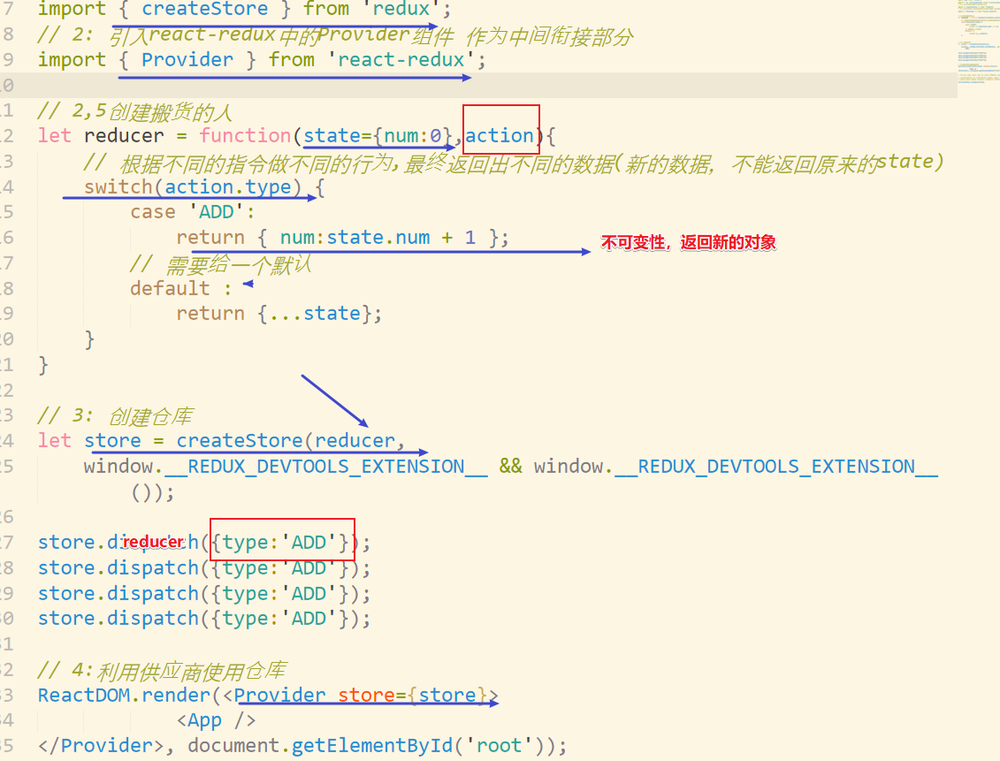

* 用来管理全局数据，多组件使用多数据，解决组件通信问题

* 依赖包 ```npm i redux react-redux -S```

* ```react
  import { createStore } from 'redux';
  import { Provider } from 'react-redux';
  import { reducer } from './reducers/ToDoReducer.js';
  let store = createStore(reducer);
  ReactDOM.render(<Provider store={store}>
    <App />
  </Provider>, document.getElementById('root'));
  ```

* 对组件进行连接

  * ```react
    import { connect } from 'react-redux';
    export default connect(getProps)(App);   // 提供this.props获取state的快捷方式，返回对象
    ```

  * 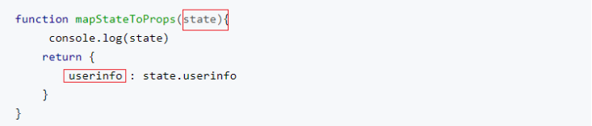

* 元素介绍

  * reducer .js 

    * 按名称导出一个reducer函数，参数state,action，相当于处理数据的中转，根据action.type指令进行操作
    * ___注意：不要更改原数据，return新数据__

  * action： 

    * ```js
      {
      	type:'指令名称',//必须有的属性
           data: any
      }
      ```

  * ```this.props.dispatch(action) 调用```

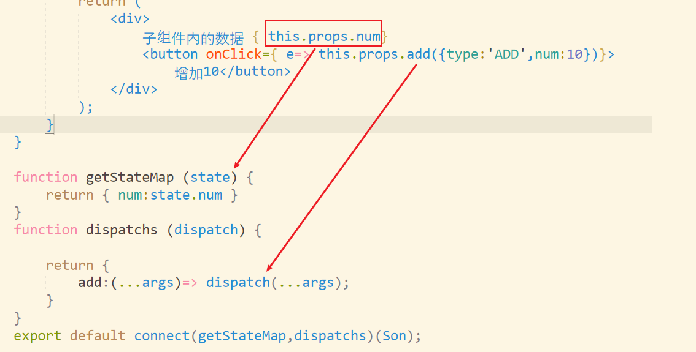

#### 代码体验

- 1. dispatch接收action，接着reducer根据action.type处理state
  2. connect提供组建内dispatch和获取state的便捷方式
     1. 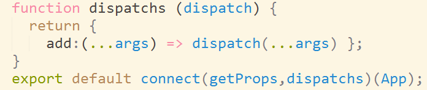
     2. 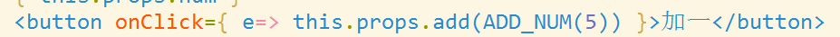
  3. 异步请求需要中间件action__下面的dispatch可以想象为 dispatch(...action);__
     1. 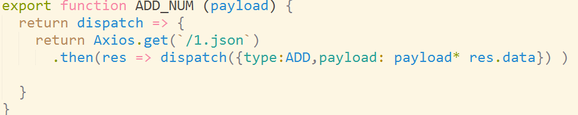
  4. combineReducers用来合并reducer
- 对象关系
  - 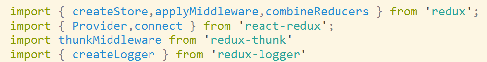

#### 异步action

* 目的 __redux是再同步中生成新的state来通知视图更新的，但是出现异步数据，就得使用插件__

* 使用
* action中的异步行为
* 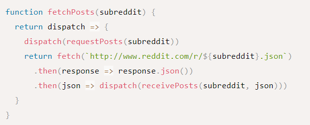


#### 配置

* ```react
  import thunkMiddleware from 'redux-thunk'
  import { createLogger } from 'redux-logger'
  import { createStore, applyMiddleware } from 'redux'
  import { selectSubreddit, fetchPosts } from './actions'？
  import rootReducer from './reducers'
  
  const loggerMiddleware = createLogger()
  
  const store = createStore(
    rootReducer,
    applyMiddleware(
      thunkMiddleware, // 允许我们 dispatch() 函数
      loggerMiddleware // 一个很便捷的 middleware，用来打印 action 日志
    )
  )
  
  store.dispatch(selectSubreddit('reactjs'))
  ```

#### 总结

- 当出现了多个reducer 可以合并，合并后dispatch会将多个reducer执行起来，按action.type区分
- 每个reducer对应不同的state,通过名称来获取

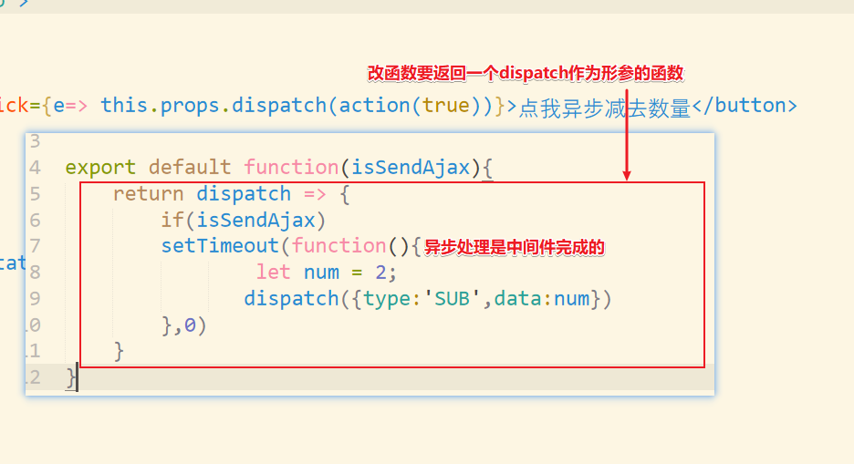


#### Dva

## 数据流向

数据的改变发生通常是通过用户交互行为或者浏览器行为（如路由跳转等）触发的，当此类行为会改变数据的时候可以通过 dispatch 发起一个 action，如果是同步行为会直接通过 Reducers 改变 State ，如果是异步行为（副作用）会先触发 Effects 然后流向 Reducers 最终改变 State，所以在 dva 中，数据流向非常清晰简明，并且思路基本跟开源社区保持一致

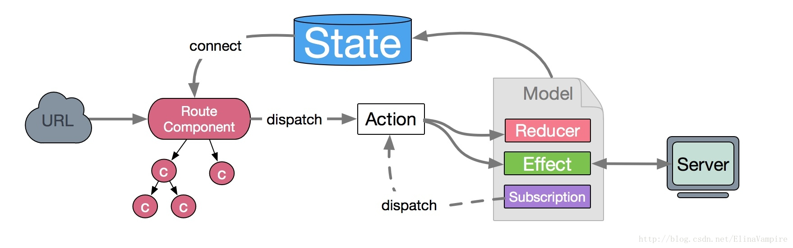

## Modul

#### 快速开始

```react
import dva from 'dva';
import createHistory from 'history/createBrowserHistory';
import createLoading from 'dva-loading';
import { connect } from 'dva'
import dynamic from 'dva/dynamic';

// 创建实例
const app = dva({
  history: createHistory(),
  // ...createLoading()
});
// 注册model
app.model({...});
// 安装插件
app.use(createLoading())
// 注册视图
app.router(appRouter);
// 启动应用
app.start('#root');

```

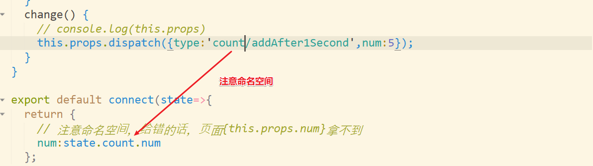

### Subscription

Subscriptions 是一种从 源 获取数据的方法，它来自于 elm。 
 Subscription 语义是订阅，用于订阅一个数据源，然后根据条件 dispatch 需要的 action。数据源可以是当前的时间、服务器的 websocket 连接、keyboard 输入、geolocation 变化、history 路由变化等等。

```react
subscriptions: {
  setup({ dispatch, history }) {
    return history.listen(async ({ pathname }, action) => {
      const re =
        pathToRegexp('/group-member/list/:groupId').exec(pathname)
        ||
        pathToRegexp('/group-member/del/:groupId').exec(pathname)
      if (action !== 'POP' && re && re[1]) {
        const groupId = +re[1]
        dispatch({ type: 'initList' })
        dispatch({ type: 'fetchGroupMemberList', groupId })
      }
    })
  },
},
```

### Effect

Effect 被称为副作用，在我们的应用中，最常见的就是异步操作。它来自于函数编程的概念，之所以叫副作用是因为它使得我们的函数变得不纯，同样的输入不一定获得同样的输出。 
 dva 为了控制副作用的操作，底层引入了redux-sagas做异步流程控制，由于采用了generator的相关概念，所以将异步转成同步写法，从而将effects转为纯函数。

```react
effects: {
  * fetchGroupMemberList({ groupId }, { call, put,select }) {
    try {
      const { succeed, data: { role, member: { list: briefs } } } =
        yield call(fetch.get, `${GROUP_MEMBER_URL}/${groupId}/1/${GROUP_MEMBER_PAGE_SIZE}`)
      if (succeed) {
        yield put({ type: 'nextList', briefs, page: 1 })
        yield put({ type: 'setIdAndRole', role })
      }
    } catch (err) {
      console.log('Error when fetch group member list', err.stack)
      yield put({ type: 'app/showToast', title: '获取群组成员列表错误' })
    }
  },
  ...
},
```

### Reducer

在 dva 中，reducers 聚合积累的结果是当前 model 的 state 对象。通过 actions 中传入的值，与当前 reducers 中的值进行运算获得新的值（也就是新的 state）。需要注意的是 Reducer 必须是纯函数，所以同样的输入必然得到同样的输出，它们不应该产生任何副作用。并且，每一次的计算都应该使用immutable data，这种特性简单理解就是每次操作都是返回一个全新的数据（独立，纯净），所以热重载和时间旅行这些功能才能够使用。

```react
reducers: {
  initList(state) {
    console.log('initLists')
    return {
      ...state,
      list: [],
    }
  },
  ...
},
```

## State

State 表示 Model 的状态数据，通常表现为一个 javascript 对象（当然它可以是任何值）；操作的时候每次都要当作不可变数据（immutable data）来对待，保证每次都是全新对象，没有引用关系，这样才能保证 State 的独立性，便于测试和追踪变化

```react
state: {
  id: 0,
  title: '全部成员',
  list: [],
  briefs: {},
  itemCount: 1,
  isManager: false,
},
```

## Action

Action 是一个普通 javascript 对象，它是改变 State 的唯一途径。无论是从 UI 事件、网络回调，还是 WebSocket 等数据源所获得的数据，最终都会通过 dispatch 函数调用一个 action，从而改变对应的数据。action 必须带有 type 属性指明具体的行为，其它字段可以自定义，如果要发起一个 action 需要使用 dispatch 函数；需要注意的是 dispatch 是在组件 connect Models以后，通过 props 传入的

```react
dispatch({ type: 'initList' })
```

dispatching function 是一个用于触发 action 的函数，action 是改变 State 的唯一途径，但是它只描述了一个行为，而 dipatch 可以看作是触发这个行为的方式，而 Reducer 则是描述如何改变数据的。 
 在 dva 中，connect Model 的组件通过 props 可以访问到 dispatch，可以调用 Model 中的 Reducer 或者 Effects

## connect

通过connect将module中的元素作为props的方式传递给component

```react
export default connect(state => { todo:state.todo } )(GroupMember)
```

  

#### dynamic路由懒加载

* ```react
  import { dynamic } from 'dva/dynamic';     
  let lazyComponent = dynamic({
      	app,
      	models:()=> [import('../models/user')],
          component:()=> import('./Add.js')
  });
  // 接着使用上述组件，效果是切块，直到加载路由才生效
  render() {
      return (
      	<div>
          {
                  routes.map(({path,component,models},key)=>{
                      return (
                          <Route key={key} path={path} component={dynamic({
                                  app:window.app,
                                  models,
                                  component})}
                           />
                      )
                  })
              }
          
          </div>
      )
  }
  ```

* 